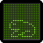

# GIF generator with a running text line

[](https://github.com/EgorKhabarov/RunningTextGifGenerator/actions/workflows/tests.yml)
[](https://codecov.io/github/EgorKhabarov/RunningTextGifGenerator)

[](https://github.com/psf/black)
[](https://github.com/python/mypy)
[](https://github.com/astral-sh/ruff)

---

```shell
git clone https://github.com/EgorKhabarov/RunningTextGifGenerator
```

```shell
pip install -r requirements.txt
```

---

```shell
git submodule add https://github.com/EgorKhabarov/RunningTextGifGenerator
git submodule update --remote
pip install -r RunningTextGifGenerator/requirements.txt
```

---

```python
from gif import GIF
gif = GIF()
gif.add_text_fragment("text", intro=True, outro=True)
gif.save(path="text.gif")
```


You can specify the width and height of the screen.
By default, they are `GIF(columns=79, rows=9)`.


The GIF class has the ability to add **text**, **image** and **gif** fragments.
Each action has its own method `add_text_fragment`, `add_image_fragment` and `add_gif_fragment` respectively.


> [!IMPORTANT]
> When adding a fragment, a generator is created to save memory.
> This means that when saving a gif, all generators will be empty after traversal.

### Examples

<table><tbody>
<tr><td colspan="3">You can create simple animations from a picture.</td></tr>
<tr><td rowspan="2">

```python
from gif import GIF
gif = GIF(columns=22, rows=24)
gif.add_image_fragment(
    image_path="dino.png",
    direction="up",
    duration=100,
    speed=24,
)
gif.save(path="dino.gif")

```
</td><td>

`dino.png`
</td><td>

`dino.gif`
</td></tr>
<tr>
<td></td>
<td></td>
</tr></tbody></table>

<table><tbody>
<tr><td colspan="2">You can use context managers and change colors.</td></tr>
<tr><td rowspan="3">

```python
from gif import GIF

# color settings for all GIF instances
# GIF.global_color_config["..."]

with GIF(20, 20, save_path="frog_jump.gif") as gif:
    gif.color_config["color_pixel_off_light"] = "#438600"
    gif.color_config["color_pixel_off_dark"] = "#346800"
    gif.color_config["color_pixel_on_light"] = "#B9FF73"
    gif.color_config["color_pixel_on_dark"] = "#6AD500"
    gif.add_image_fragment("frog_jump.png", duration=100, speed=21)

```
</td><td>

`frog_jump.gif`
</td></tr>
<tr>
<td></td>
</tr>
<tr>
<td>

`frog_jump.png`
</td></tr>
<tr><td colspan="2">
</td>
</tr></tbody></table>


<table><tbody>
<tr><td colspan="2">You can combine different fragments with each other.<br>It is important that the sizes of the pictures and gifs match the sizes of the main gif.</td></tr>
<tr><td rowspan="4">

```python
from gif import GIF
gif = GIF()
gif.add_text_fragment("this is text.gif:")
gif.add_gif_fragment(gif_path="text.gif")
gif.save(path="text_text.gif")
```
</td><td>

`text.gif`</td></tr>
<td></td>
<tr><td>

`text_text.gif`</td></tr>
<tr><td></td></tr>
</tbody></table>


### Bad Apple on RunningTextGifGenerator


<details><summary>Code</summary>

```python
"""
Download zip from https://github.com/Felixoofed/badapple-frames/blob/main/frames.zip
"""
import io
import math
import zipfile

from PIL import Image

from gif import GIF


c = 1.3333333333333333
x = 90
y = math.ceil(x / c)
gif = GIF(columns=x, rows=y)
gif.color_config["color_pixel_off_light"] = "#EFEFEF"
gif.color_config["color_pixel_off_dark"] = "#BFBFBF"
gif.color_config["color_pixel_on_light"] = "#2F2F2F"
gif.color_config["color_pixel_on_dark"] = "#000000"


with zipfile.ZipFile("frames.zip", "r") as zip_ref:
    for i in range(1, 6573, 3):
        filename = f"frames/output_{i:0>4}.jpg"
        with zip_ref.open(filename) as file:
            image = Image.open(io.BytesIO(file.read()))
            gif.add_image_fragment(
                image_path=image.resize((x, y)),
                duration=50,
            )

gif.save(path="bad_apple.gif")
```
</details>

The font can be downloaded [here](https://fonts-online.ru/fonts/monocraft)
